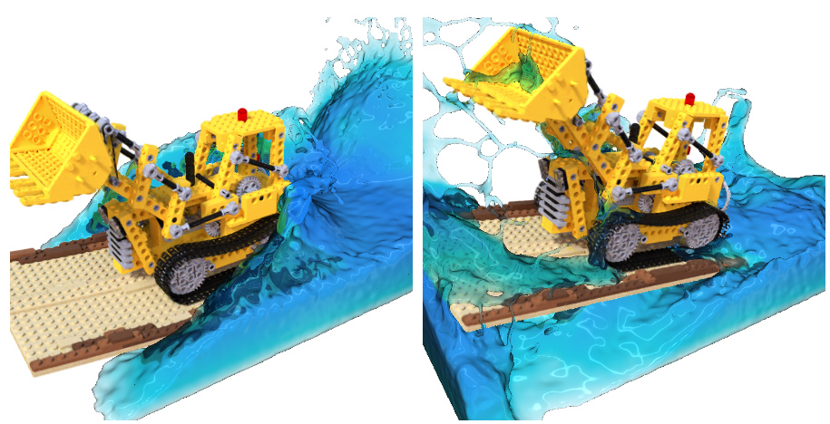
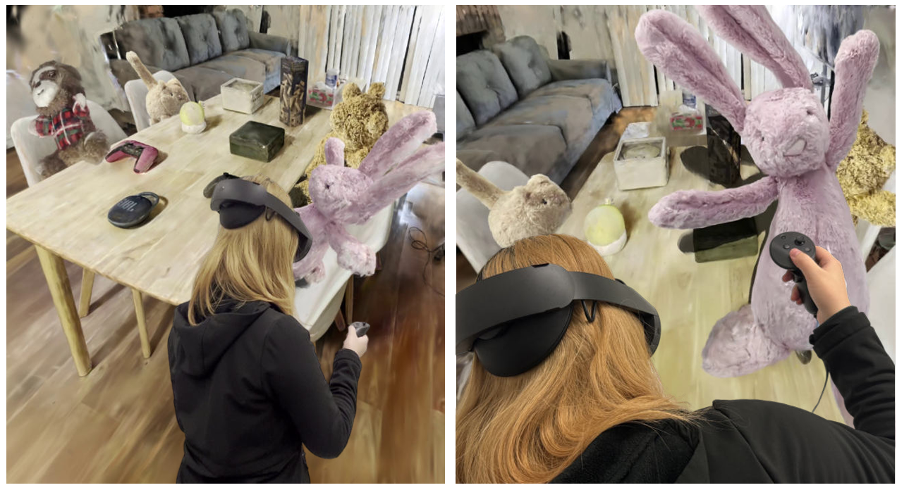
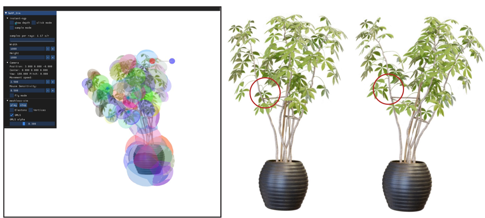
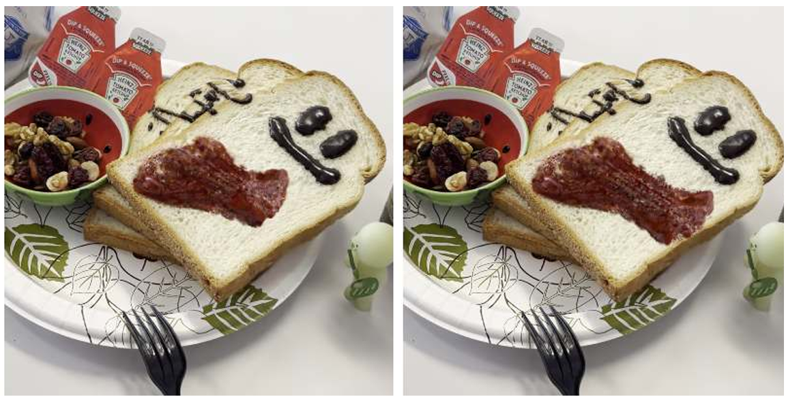


  You can also find my articles on <u><a href="{{author.googlescholar}}">my Google Scholar profile</a>.</u>





  


      

        

        

      

      

        

        <table>
          <tr>
          <td style="vertical-align:middle" width="35%">
            
          </td>
          <td style="vertical-align:middle">
            <h3 class="publication-title">
                  <a class="text-dark" >Gaussian Splashing: Dynamic Fluid Synthesis with Gaussian Splatting</a>
              </h3> 
            
            

              
              
              <strong>Yutao Feng*</strong>, Xiang Feng*, Yintong Shang, Ying Jiang, Chang Yu, Zeshun Zong, Tianjia Shao, Hongzhi Wu, Kun Zhou, Chenfanfu Jiang, and Yin Yang.
            

             
            

              *Equal contributions.
            

            
            
 <a class="publication-journal">Arxiv.</a>  2024.

            

                  
                  <strong><a href="https://arxiv.org/abs/2401.15318" target="_blank">[Paper]</a></strong>      
                  
                  <strong><a href="https://amysteriouscat.github.io/GaussianSplashing/" target="_blank">[Project Page]</a></strong>
                  
                  
            

            
            </td>
            </tr>
          
        </table>
      

      

        

        

      

      

        

        <table>
          <tr>
          <td style="vertical-align:middle" width="35%">
            
          </td>
          <td style="vertical-align:middle">
            <h3 class="publication-title">
                  <a class="text-dark" >VR-GS: A Physical Dynamics-Aware Interactive Gaussian Splatting System in Virtual Reality</a>
              </h3> 
            
            

              
              
              Ying Jiang*, Chang Yu*, Tianyi Xie*, Xuan Li*, <strong>Yutao Feng</strong>, Huamin Wang, Minchen Li, Henry Lau, Feng Gao, Yin Yang, and Chenfanfu Jiang.
            

             
            

              *Equal contributions.
            

            
            
 <a class="publication-journal">Arxiv.</a>  2024.

            

                  
                  <strong><a href="https://arxiv.org/abs/2401.16663" target="_blank">[Paper]</a></strong>      
                  
                  <strong><a href="https://yingjiang96.github.io/VR-GS/" target="_blank">[Project Page]</a></strong>
                  
                  
            

            
            </td>
            </tr>
          
        </table>
      

      

        

          
        

      

      

        

        <table>
          <tr>
          <td style="vertical-align:middle" width="35%">
            
          </td>
          <td style="vertical-align:middle">
            <h3 class="publication-title">
                  <a class="text-dark" >PIE-NeRF: Physics-based Interactive Elastodynamics with NeRF</a>
            </h3> 
            
            

              
              
              <strong>Yutao Feng*</strong>, Yintong Shang*, Xuan Li, Tianjia Shao, Chenfanfu Jiang, and Yin Yang.
            

            

              *Equal contributions.
            

             
            
 <a class="publication-journal">Arxiv.</a>  2023.

            

                  
                  <strong><a href="https://arxiv.org/abs/2311.13099" target="_blank">[Paper]</a></strong>
                                    
                  <strong><a href="https://fytalon.github.io/pienerf/" target="_blank">[Project Page]</a></strong>
                  
            

            
            </td>
            </tr>
            
        </table>
      

      

        

        

      

      

        

        <table>
          <tr>
          <td style="vertical-align:middle" width="35%">
            
          </td>
          <td style="vertical-align:middle">
            <h3 class="publication-title">
                  <a class="text-dark" >PhysGaussian: Physics-Integrated 3D Gaussians for Generative Dynamics</a>
              </h3> 
            
            

              
              
              Tianyi Xie*, Zeshun Zong*, Yuxing Qiu*, Xuan Li*, <strong>Yutao Feng</strong>, Yin Yang, and Chenfanfu Jiang.
            

             
            

              *Equal contributions.
            

            
            
 <a class="publication-journal">Arxiv.</a>  2023.

            

                  
                  <strong><a href="https://arxiv.org/pdf/2311.12198.pdf" target="_blank">[Paper]</a></strong>

                  <strong><a href="https://xpandora.github.io/PhysGaussian/" target="_blank">[Project Page]</a></strong>
                  
                  
            

            
            </td>
            </tr>
            
      </table>
      

